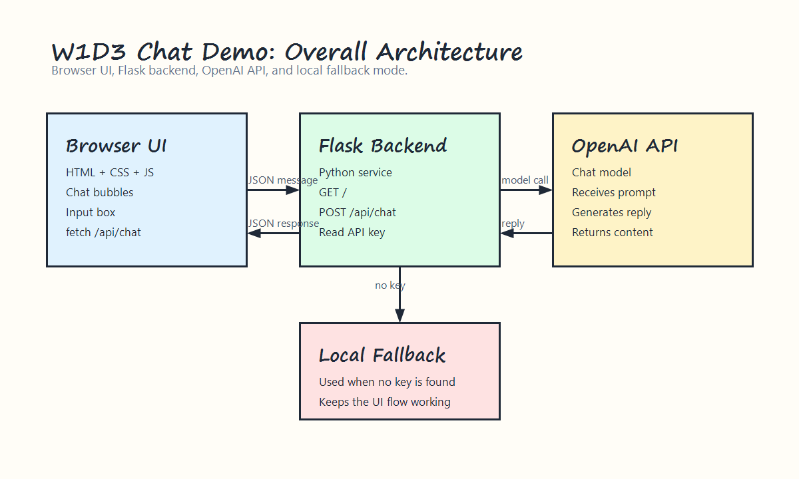
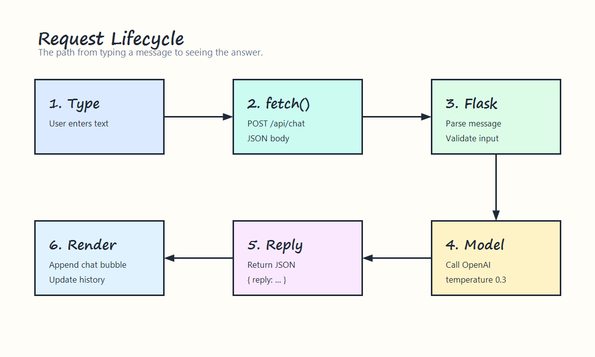
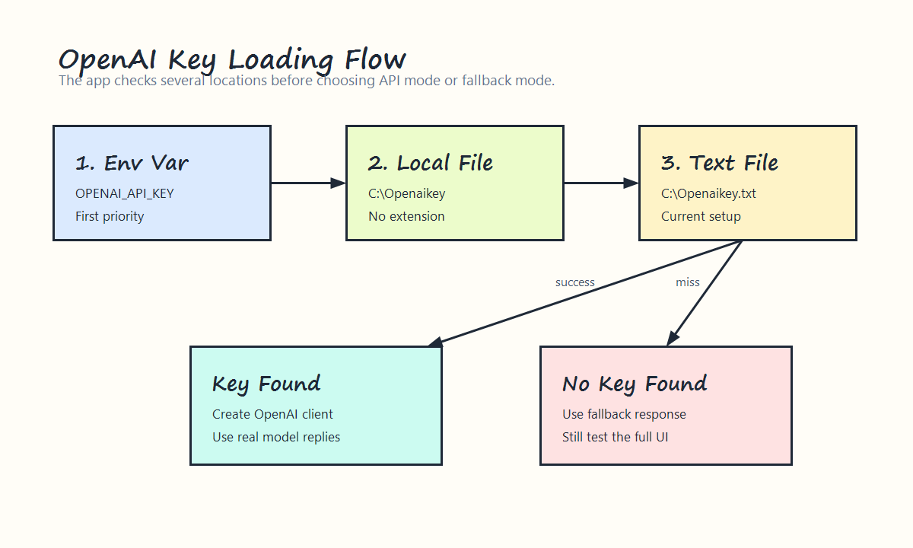
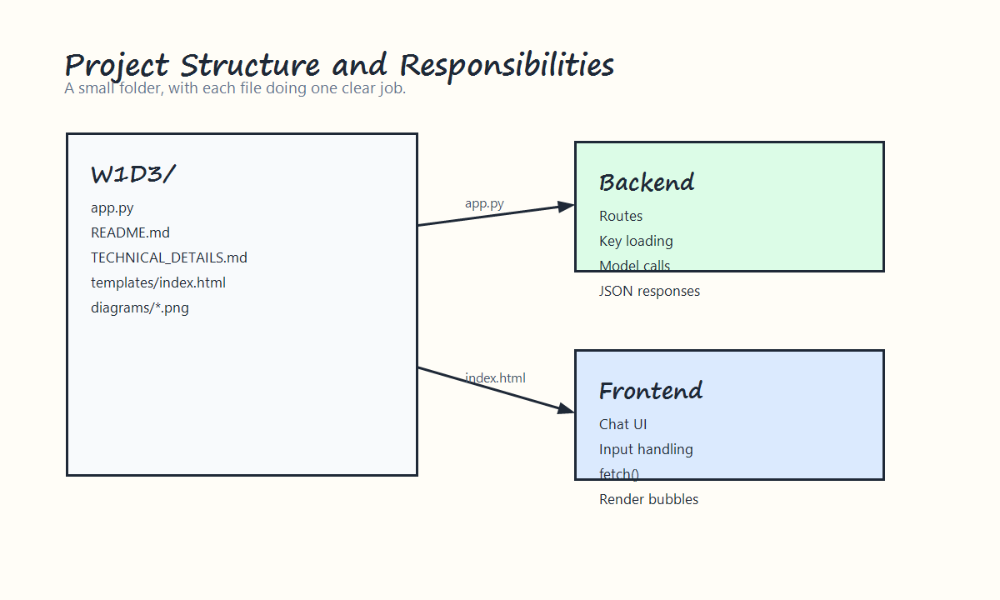
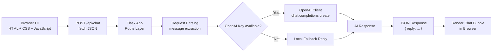

# W1D3 Technical Details

这份文档面向刚开始接触开发的学习者，目标是帮助你理解这个 `W1D3` 聊天 Demo 的技术组成、请求流程，以及站在中级开发者视角该如何看它的架构。

如果 Codex 内置浏览器无法渲染下面的图片，请打开图文内嵌版：

- [TECHNICAL_DETAILS_EMBEDDED.html](E:/Learning/working_Content/generative-ai-for-beginners/07-building-chat-applications/python/W1D3/TECHNICAL_DETAILS_EMBEDDED.html)

## 0. 图解导览

下面几张图用 Excalidraw 风格绘制，建议先看图，再读后面的文字说明。

### 整体架构



### 请求流转



### OpenAI Key 加载流程



### 项目结构与职责



## 1. 这是一个什么项目

这是一个最小可运行的 AI 聊天网站 Demo。

你在网页输入一条消息后：

1. 前端页面读取输入内容。
2. 浏览器把消息发送到后端接口 `/api/chat`。
3. Flask 后端收到消息后，调用 OpenAI 模型。
4. 模型返回回复。
5. 后端把回复再返回给前端页面展示出来。

这个项目的重点不在“功能很多”，而在“流程完整”：

- 有页面
- 有后端接口
- 有模型调用
- 有异常兜底

## 2. 技术栈说明

### Python

后端使用 `Python` 编写。  
它负责组织程序逻辑，比如读取 Key、接收请求、调用模型、返回结果。

项目中的核心后端代码在：

- [app.py](E:/Learning/working_Content/generative-ai-for-beginners/07-building-chat-applications/python/W1D3/app.py)

### Flask

`Flask` 是一个轻量级 Python Web 框架。  
你可以把它理解成：让 Python 程序具备“网站服务能力”的工具。

它在这个项目里负责：

- 启动本地服务
- 提供网页地址 `/`
- 提供聊天接口 `/api/chat`
- 把 HTML 页面返回给浏览器
- 把 JSON 数据返回给前端

### OpenAI Python SDK

`OpenAI Python SDK` 是官方提供的 Python 调用库。  
它的作用是让后端程序可以用 Python 代码直接请求 OpenAI 模型。

在本项目中，它主要负责：

- 创建客户端
- 发送用户消息
- 接收模型回复

### HTML

`HTML` 负责页面结构。  
例如标题、聊天区域、输入框、按钮，都是 HTML 描述出来的。

### CSS

`CSS` 负责页面样式。  
它控制了颜色、布局、间距、边框、圆角，以及聊天气泡的视觉效果。

### JavaScript

`JavaScript` 负责页面交互。  
它在这个项目中主要做 4 件事：

1. 监听用户点击发送按钮
2. 读取输入框内容
3. 调用 `/api/chat`
4. 把结果显示回聊天窗口

### Jinja2 模板

`Jinja2` 是 Flask 默认使用的模板引擎。  
简单理解：它允许后端把变量插入 HTML 页面中。

例如页面中显示：

- 当前是不是 `OpenAI API` 模式
- 当前使用的模型名

这些信息不是写死的，而是 Flask 渲染模板时动态传进去的。

## 3. 目录与文件职责

### [app.py](E:/Learning/working_Content/generative-ai-for-beginners/07-building-chat-applications/python/W1D3/app.py)

这是后端主程序，负责：

- 创建 Flask 应用
- 读取 OpenAI Key
- 初始化 OpenAI 客户端
- 提供首页 `/`
- 提供聊天接口 `/api/chat`
- 在没有 Key 时启用本地回退模式

### [templates/index.html](E:/Learning/working_Content/generative-ai-for-beginners/07-building-chat-applications/python/W1D3/templates/index.html)

这是前端页面，负责：

- 展示聊天 UI
- 管理输入框和按钮
- 展示聊天记录
- 通过 `fetch()` 调用后端接口

### [README.md](E:/Learning/working_Content/generative-ai-for-beginners/07-building-chat-applications/python/W1D3/README.md)

这是使用说明文档，负责：

- 说明如何启动项目
- 说明访问地址
- 说明接口入口

## 4. 浏览器和后端是如何通信的

当前页面通过 `fetch()` 发起请求，请求格式大致如下：

```json
{
  "message": "请解释什么是 few-shot prompting"
}
```

后端收到后，会执行：

1. 解析 JSON
2. 读取 `message`
3. 调用模型
4. 返回：

```json
{
  "reply": "模型的回答内容"
}
```

这个过程是一个典型的“前后端分离式交互”。

## 5. 为什么需要后端

很多初学者会问：为什么不能让网页直接调用 OpenAI？

原因主要有两个：

1. 安全性  
如果把 OpenAI Key 写在前端页面里，任何打开网页的人都可能看到。

2. 控制能力  
后端更容易增加日志、鉴权、限流、错误处理、提示词管理等能力。

所以标准做法是：

- 前端负责展示和交互
- 后端负责保存密钥和调用模型

## 6. 为什么会有“本地回退模式”

这个项目里有一个很实用的设计：如果没有读取到 OpenAI Key，就进入本地回退模式。

这样做的目的是降低学习门槛：

- 先让页面跑起来
- 先让请求链路打通
- 再逐步接入真实模型

这对初学者很友好，因为你可以先确认：

- 页面有没有工作
- 接口有没有工作
- 数据有没有来回跑通

之后再处理 Key 或网络问题。

## 7. OpenAI Key 是怎么读取的

程序会按顺序尝试以下来源：

1. 环境变量 `OPENAI_API_KEY`
2. `C:\Openaikey`
3. `C:\Openaikey.txt`
4. 其他匹配 `C:\Openaikey*` 的文件

这样做是为了兼容不同使用习惯，减少因为文件命名不同导致的启动失败。

## 8. 中级开发者视角：架构图

下面这张图适合从“系统流转”和“模块职责”角度理解这个 Demo。



## 9. 中级开发者如何评价这个架构

从中级开发者角度看，这个 Demo 是一个“单体、最小、可学习”的结构。

它的优点：

1. 结构简单，适合教学
2. 前后端职责清晰
3. 支持真实模型与本地回退两种模式
4. 便于继续扩展

它当前的局限：

1. 还没有多轮上下文记忆
2. 还没有日志分层
3. 还没有鉴权和限流
4. 还没有系统提示词配置化
5. 还没有持久化聊天记录

## 10. 如果继续往真实项目演进

一个中级开发者通常会把这个项目继续拆到下面几个方向：

### API 层

- 请求参数校验
- 统一错误格式
- 状态码规范化

### 服务层

- 把“模型调用逻辑”从路由函数里拆出去
- 单独封装 chat service

### 配置层

- 把模型名、系统提示词、Key 路径放进配置对象

### 可观测性

- 增加请求日志
- 增加错误日志
- 增加耗时统计

### 产品能力

- 多轮会话
- 清空会话
- 会话持久化
- 敏感内容拦截

## 11. 对技术小白最重要的理解

你现在不需要一开始就记住所有术语，最重要的是先牢牢记住这条主线：

1. 网页负责“展示和发送”
2. Flask 负责“接收和转发”
3. OpenAI 负责“生成回答”
4. 最终答案再回到网页

你已经完成的是一个 AI Web 应用最关键的第一步：  
把“界面 -> 接口 -> 模型 -> 回复”这条完整链路跑通了。
