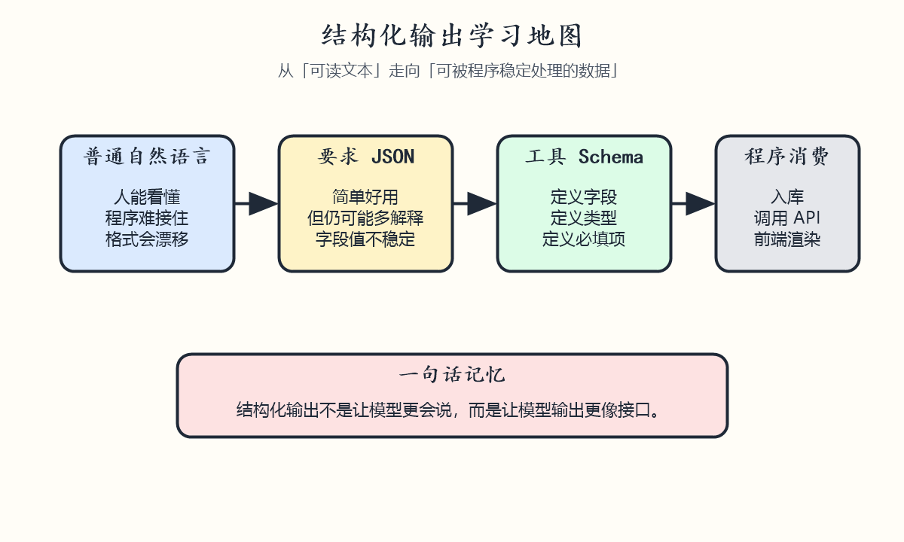
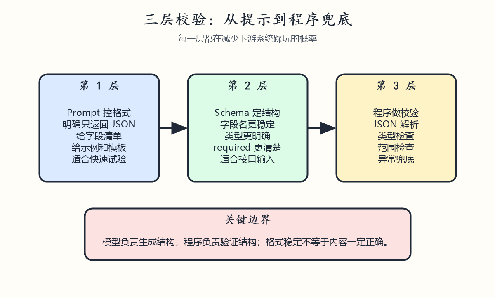
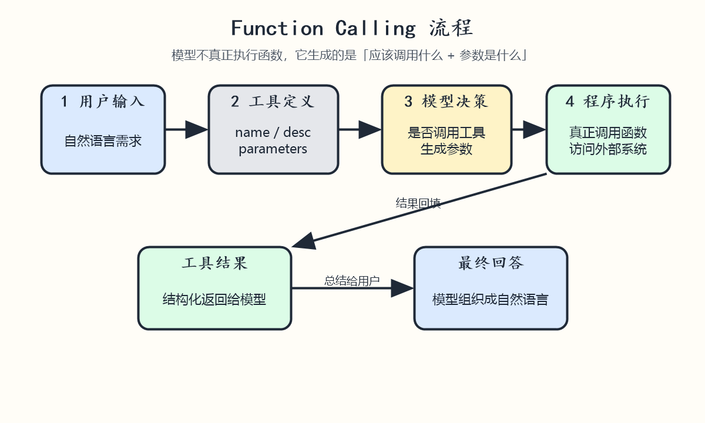
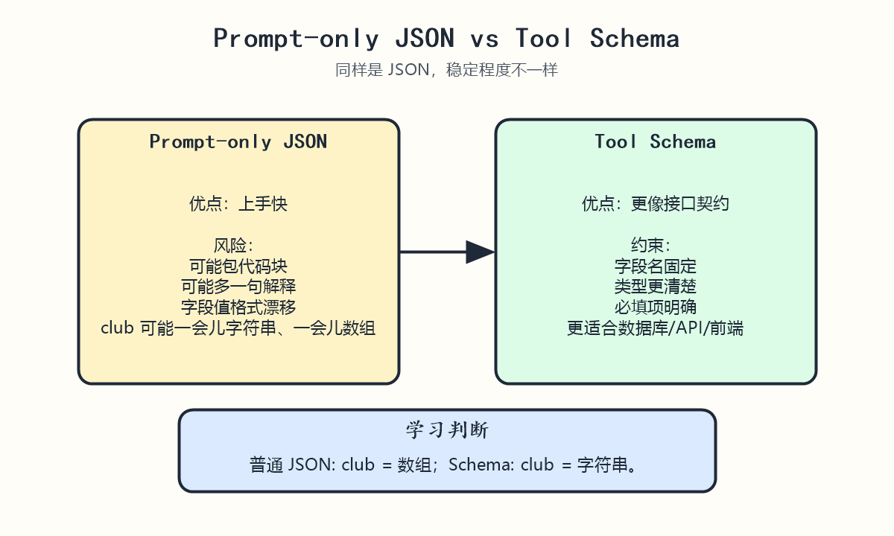

# W2D1 结构化输出

## 对应仓库位置

- 核心 lesson: `11-integrating-with-function-calling`
- 配套理解: `04-prompt-engineering-fundamentals`
- 配套理解: `05-advanced-prompts`

## 图解速览









## 这节课在学什么

结构化输出，核心是在问模型时，不只关心“它说了什么”，还关心“它能不能按程序可消费的格式稳定地说出来”。

如果模型只是返回自然语言，我们人能看懂，但程序不一定能稳定接住。
如果模型返回固定字段、固定类型、固定格式的数据，后续就更容易：

- 写入数据库
- 调用 API
- 交给前端渲染
- 作为下一步工作流输入

一句话理解：

- 普通输出关注“可读”
- 结构化输出关注“可处理”

## 为什么需要结构化输出

在真实应用里，LLM 往往不是最后一站，而是中间一环。
它的输出经常要流向别的系统，所以我们需要结果尽量稳定。

仓库第 11 课举了一个很典型的问题：

- 两段很像的学生描述
- 用同样的 prompt 提取 JSON
- 返回的 `grades` 却可能一个是 `3.7`，另一个是 `3.7 GPA`

这说明即使“看起来像 JSON”，字段值的格式仍可能不一致。

所以结构化输出不是为了“好看”，而是为了：

1. 降低解析成本
2. 降低下游系统出错概率
3. 提高工作流自动化程度
4. 让模型输出更接近“接口契约”

## 对应到 04、05、11 三课怎么理解

### 04 提示工程基础告诉我们的事

第 04 课重点不是工具调用，而是先学会控制模型输出：

- 指令要具体
- 要明确格式要求
- 可以给 example
- 可以给 cue
- 可以把输出要求写成模板

这一步可以理解为：先让模型“尽量按格式说话”。

### 05 高级提示技巧告诉我们的事

第 05 课进一步说明：

- 简单 prompt 不够稳定
- few-shot 能帮助模型更接近目标格式
- 约束越明确，输出越容易可控
- 结果不能盲信，要验证和迭代

这一步可以理解为：通过更强的提示技巧，提升输出的一致性和可预测性。

### 11 Function Calling 真正把结构化输出落地

第 11 课是这周最关键的锚点。
它把“格式要求”升级成“schema 约束”：

- 你不只是告诉模型“请返回 JSON”
- 你还告诉它有哪些字段
- 每个字段是什么类型
- 哪些字段必填

这样模型更像是在“填一张表”，而不是“自由发挥写一段话”。

## 三种层次的结构化输出

### 第一层：Prompt 里要求 JSON

例如：

- 请提取姓名、学校、GPA
- 只返回 JSON

这是最容易上手的一层，优点是简单，缺点是依旧不够稳。

常见问题：

- 可能包在 ```json 代码块里
- 可能多解释一句
- 字段名大小写不统一
- 字段值格式不统一
- 缺字段或多字段

### 第二层：Function Calling / Tool Schema

这是仓库第 11 课的重点。

你先定义一个工具或函数的 schema，例如：

- `name`: string
- `major`: string
- `school`: string
- `grades`: string
- `club`: string

模型不是直接给你一段随意文本，而是优先按这个函数参数结构返回。

优点：

- 更稳定
- 更适合程序消费
- 更适合串联外部工具

### 第三层：程序端再次校验

这一步非常重要。
哪怕模型已经按 schema 输出，也不要把它当成 100% 可信输入。

程序端还应该做：

- JSON 解析
- 必填字段校验
- 类型校验
- 枚举值校验
- 范围校验
- 异常兜底

一句话：

- 模型负责生成结构
- 程序负责验证结构

## 这节课最该抓住的核心概念

### 1. 结构化输出不是“让回答更漂亮”

它的真正目标是让输出可以稳定进入下一步系统。

### 2. “请返回 JSON” 不等于真正可靠

这只是弱约束。
它能提高概率，但不能替代 schema 和校验。

### 3. Function Calling 的本质不是模型真的去执行函数

模型做的是：

- 选择是否需要某个工具
- 生成符合该工具参数结构的内容

真正执行函数的是你的程序。

### 4. 结构化输出和工具调用是强相关的

因为很多时候我们不是只想“得到答案”，而是想“得到一份能驱动动作的数据”。

例如：

- 搜课程
- 发邮件
- 查数据库
- 调天气 API

## 这节课的高频注意点

### 1. 字段设计要清楚

字段名不要模糊。

例如 `grades` 是否一定是 GPA？
如果一定是，最好直接命名成 `gpa` 或 `grades_gpa`。

### 2. 类型要尽量明确

如果你需要数值，最好不要只写成自由文本。
否则后面还得自己二次清洗。

### 3. required 要认真设计

不是所有字段都必须填。
如果某字段可能缺失，要考虑：

- 设为可选
- 允许 `null`
- 或在程序里做缺省值处理

### 4. 不要把业务执行权完全交给模型

例如发送邮件、下单、删除数据、支付等动作，程序端必须做确认和白名单校验。

### 5. 输出稳定不代表内容一定正确

结构化只解决“格式问题”，不自动解决“事实正确性问题”。

模型可以非常工整地输出一份错误 JSON。

### 6. 结果要为下游系统设计

设计结构时先想：

- 这份数据接下来给谁用
- 前端怎么展示
- 数据库怎么存
- API 怎么吃

## 你可以怎么学这节课

建议按这个顺序：

1. 先看 `11-integrating-with-function-calling/README.md`
2. 理解为什么“同样 prompt，JSON 仍可能不一致”
3. 再看 notebook 里的参数 schema 设计
4. 最后运行本地 demo，对比“普通 prompt 输出”和“schema 化输出”

## 本地练习目标

做完这节课，至少要能回答下面 4 个问题：

1. 什么叫结构化输出？
2. 为什么只靠“返回 JSON”还不够？
3. Function Calling 为什么能让输出更稳定？
4. 为什么程序端还需要做校验？

## 今天的最简记忆版

- Prompt 控格式，是第一步
- Schema 定结构，是第二步
- 程序做校验，是第三步

一句话总结：

结构化输出不是让模型“更会说”，而是让它“更像接口”。
