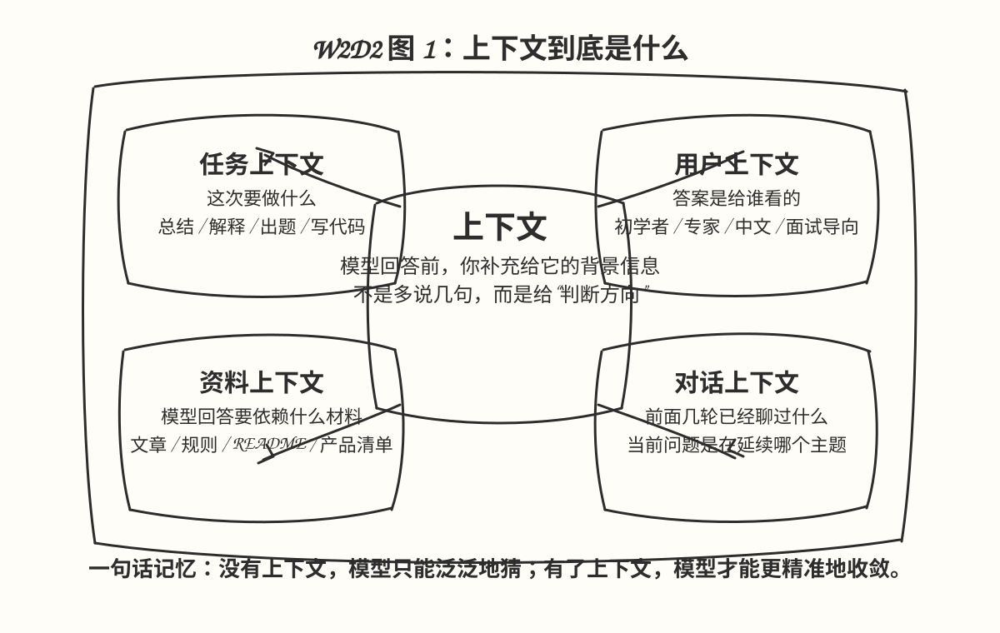
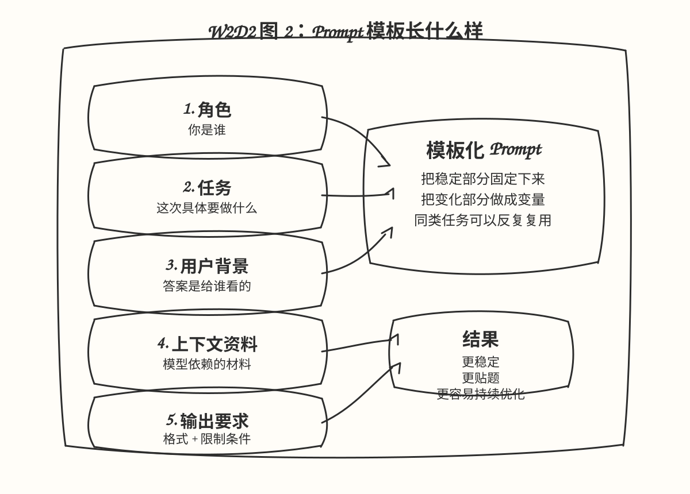
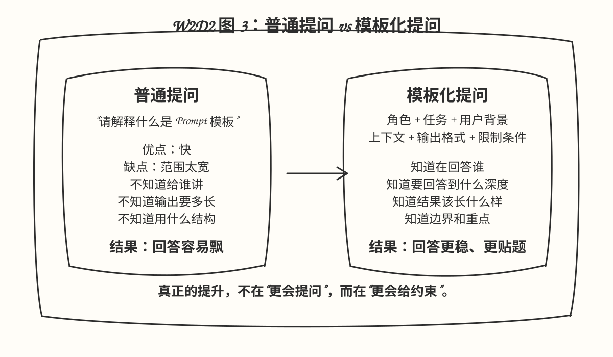
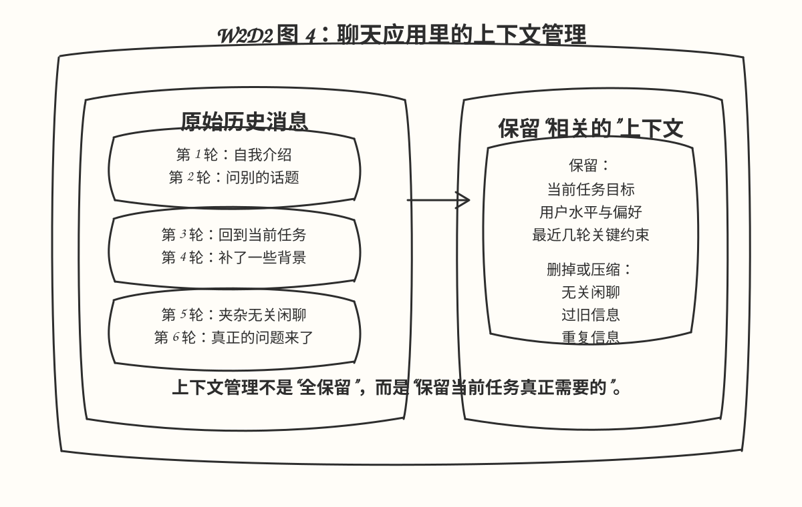

# W2D2 上下文与模板

## 对应仓库位置

- 核心 lesson: `04-prompt-engineering-fundamentals`
- 核心 lesson: `05-advanced-prompts`
- 配套理解: `07-building-chat-applications`

## 图解速览









## 这节课在学什么

W2D2 的主题不是单纯“怎么问 AI”，而是学会：

- 如何给模型补充足够的上下文
- 如何把 Prompt 写成可以反复复用的模板
- 如何让输出更稳定、更贴近目标用户

一句话理解：

- 上下文解决“模型知不知道你真正要什么”
- 模板解决“你能不能稳定地重复得到像样结果”

## 为什么这节课重要

如果只给模型一句很短的问题，它通常也能回答，但经常会出现下面这些问题：

- 回答太泛，不够贴题
- 没有考虑用户水平
- 输出格式不稳定
- 同一类任务每次都要重新写 Prompt

所以这节课的核心不是追求“更花哨的提示词”，而是学会构造一个更稳定的输入结构。

## 什么是上下文

可以把上下文理解成：模型在回答之前，你额外提供给它的背景信息。

最常见的上下文有 4 类：

1. 任务上下文
   例：这次要做的是总结、翻译、解释、出题，还是代码生成。

2. 用户上下文
   例：用户是初学者、面试者、老师、产品经理，还是开发者。

3. 资料上下文
   例：文章内容、业务规则、产品清单、知识库片段。

4. 对话上下文
   例：前面几轮已经讨论过什么，这一轮问题是在延续哪个主题。

一句话记忆：

- 没有上下文，模型只能泛泛地猜
- 有了上下文，模型才能更准确地收敛

## 什么是模板

模板就是把 Prompt 写成固定结构，然后把变化部分留成变量。

最基础的模板可以写成这样：

```text
你是一个{{role}}。
你的任务是{{task}}。

用户背景：
{{user_profile}}

可用上下文：
{{context}}

请按以下格式输出：
{{output_format}}

约束条件：
{{constraints}}
```

这里的重点不是语法，而是思路：

- 固定住稳定部分
- 参数化变化部分
- 让同一类任务可以重复使用

## Prompt 的 6 个核心槽位

一个质量比较高的 Prompt，通常至少可以拆成下面 6 个槽位：

### 1. 角色

告诉模型它现在是谁。

例子：

- 你是一名中文 AI 学习教练
- 你是一名耐心的 Python 导师
- 你是一名帮助用户整理 README 的工程助手

### 2. 任务

明确这一次具体要做什么。

例子：

- 请解释什么是 Prompt 模板
- 请根据材料生成一份课程提纲
- 请把输入文本总结成 5 条要点

### 3. 用户背景

告诉模型答案是给谁看的。

例子：

- 用户是 LLM 初学者
- 用户已经学过变量和循环，但没学过函数
- 用户希望用中文快速上手

### 4. 资料上下文

把模型本轮回答真正依赖的信息喂进去。

例子：

- 一段文章
- 一组产品说明
- 某个仓库的 README
- 某个领域的规则列表

### 5. 输出格式

告诉模型结果应该长什么样。

例子：

- 用 3 段话回答
- 先定义，再举例，最后总结
- 输出成 Markdown
- 输出成 JSON

### 6. 约束条件

告诉模型边界在哪里。

例子：

- 控制在 300 字内
- 不要使用太多术语
- 适合初学者阅读
- 不要编造资料中没有的信息

## 对应到 lesson 04 的核心理解

`04-prompt-engineering-fundamentals` 主要帮我们建立 Prompt 结构意识。

这一章最重要的点有：

- Prompt 不只是一个问题
- Prompt 可以包含 instruction、context、format、example
- system message 会直接影响模型行为
- Prompt Engineering 的目标是让结果更稳定、更相关

这一章更像在回答：

- Prompt 为什么重要
- Prompt 该由哪些部分组成

## 对应到 lesson 05 的核心理解

`05-advanced-prompts` 更贴近 W2D2，因为它真正开始讨论“怎么把上下文和模板写进去”。

这章最重要的 4 个点：

### 1. Context

上下文本身就是 Prompt 的核心组成部分。  
如果不告诉模型范围，它很可能给出宽泛但无用的结果。

### 2. Zero-shot

直接提要求，不给例子。  
优点是简单，缺点是容易发散。

### 3. Few-shot

给 1 到 3 个例子，让模型模仿你的风格、结构或格式。  
适合你想固定输出风格的时候。

### 4. Generated knowledge

这和 W2D2 最相关。  
它的核心思路是：先把你自己的知识、规则、资料拼进 Prompt，再让模型处理。

例如：

```text
课程主题：{{topic}}
用户水平：{{level}}
参考资料：{{context}}

请基于以上资料，生成一份适合该用户水平的学习讲解。
```

这其实就是“模板 + 上下文”的最直接应用。

## 对应到 lesson 07 的核心理解

`07-building-chat-applications` 主要补“上下文管理”。

这章最值得抓住的是：

### 1. 上下文保留

聊天应用不是一次性问答，而是多轮对话。  
所以要考虑前面几轮内容是否继续保留。

### 2. 上下文不能无限累积

不是消息越多越好。  
上下文越长，成本越高，也越容易冲淡重点。

### 3. 用户画像也是上下文

例如：

- 用户更喜欢中文
- 用户是初学者
- 用户要简明版解释

这些都可以作为稳定上下文，持续影响回答风格。

一句话理解：

- Prompt 模板解决“一次问得更清楚”
- 上下文管理解决“多轮聊得不跑偏”

## 今天最该掌握的 4 个结论

### 1. Prompt 不是随手一句话

真正稳定的 Prompt，往往是一个结构化输入，而不是临时想到什么问什么。

### 2. 上下文比“花哨词汇”更重要

很多时候回答不好，不是模型不够强，而是你没有把背景交代清楚。

### 3. 模板的价值是复用

只要任务类型相似，就应该优先写模板，而不是每次重写 Prompt。

### 4. 聊天应用里的上下文要“保留相关的”

不是保留全部历史，而是保留当前任务需要的关键信息。

## 一个最小可用模板

这是一份今天就可以直接拿来用的模板：

```text
你是一名{{assistant_role}}。

你的任务是：{{task}}

用户背景：
{{user_profile}}

可用上下文：
{{context}}

请按以下格式输出：
{{output_format}}

请遵守以下限制：
{{constraints}}
```

## 一个学习场景示例

比如你想做一个“AI 学习助手”，可以这样写：

```text
你是一名中文 AI 学习教练。

你的任务是：向用户解释一个技术概念。

用户背景：
- 是 LLM 初学者
- 喜欢中文说明
- 希望先理解概念，再看例子

可用上下文：
主题：Prompt 模板

请按以下格式输出：
1. 一句话定义
2. 一个简单例子
3. 两个常见误区
4. 一个练习题

请遵守以下限制：
- 用中文
- 不要堆术语
- 控制在 300 字内
```

## 今天可以立刻做的最小练习

同一个题目，做 3 次实验：

题目：解释什么是 Prompt 模板

### 实验 1：裸问

```text
请解释什么是 Prompt 模板。
```

### 实验 2：加用户背景

```text
请向一位刚开始学 LLM 的初学者解释什么是 Prompt 模板。
```

### 实验 3：加完整模板

```text
你是一名 AI 学习教练。
请向一位刚开始学 LLM 的初学者解释什么是 Prompt 模板。

要求：
1. 先给定义
2. 再给一个例子
3. 最后说明为什么重要
4. 控制在 300 字内
5. 用中文
```

观察这 3 件事：

- 回答是否更聚焦
- 结构是否更稳定
- 是否更适合目标读者

## 今天的交付物应该是什么

按照你的 Notion 计划，W2D2 的交付物是“小应用题目确定”。

如果学完今天内容，最好至少产出下面 3 个成果：

1. 你能用自己的话解释
   什么是上下文，什么是模板，它们有什么区别。

2. 你能写出一个可复用 Prompt 模板
   而不是只会临时问一句话。

3. 你能定一个小应用题目
   并说明它为什么需要“上下文 + 模板”。

## 最推荐的小应用题目

我最推荐：

- AI 学习助手

原因很简单：

- 很适合用用户背景做上下文
- 很适合固定输出模板
- 后续也容易扩展到聊天、多轮记忆、函数调用

最小版输入可以是：

- 学习主题
- 用户水平
- 学习目标

最小版输出可以是：

- 概念解释
- 示例
- 常见误区
- 练习题

## 自测问题

学完这节后，检查自己能不能回答这 5 个问题：

1. 什么是上下文？它为什么会影响模型回答？
2. 什么是 Prompt 模板？它和普通提问有什么区别？
3. 什么情况下应该补用户背景？
4. 什么情况下应该补示例？
5. 为什么聊天应用不能无限保留全部上下文？

## 自测参考答案

### 1. 什么是上下文？它为什么会影响模型回答？

上下文就是你在提问之外，额外提供给模型的背景信息，比如任务目标、用户水平、资料内容、对话历史等。

它之所以会影响模型回答，是因为模型并不真正理解你的隐含意图，而是根据当前输入去推断下一步最可能的输出。  
上下文越清晰，模型越容易收敛到你真正想要的方向；上下文越少，回答就越容易泛化、跑偏或者不稳定。

### 2. 什么是 Prompt 模板？它和普通提问有什么区别？

Prompt 模板就是把一类任务写成固定结构，把变化部分留成变量。

比如固定住：

- 角色
- 任务
- 用户背景
- 上下文
- 输出格式
- 约束条件

普通提问往往是临时想到什么问什么，虽然快，但结果不稳定。  
模板更适合重复使用、持续优化和批量复用，所以更接近真实应用里的做法。

### 3. 什么情况下应该补用户背景？

当回答效果会因为“回答对象不同”而明显变化时，就应该补用户背景。

例如：

- 用户是初学者还是专家
- 用户希望中文还是英文
- 用户想要快速结论还是详细讲解
- 用户更关注面试、教学还是项目落地

只要你希望模型根据“对象是谁”来调整回答方式，就应该补这一类信息。

### 4. 什么情况下应该补示例？

当你希望模型模仿某种固定风格、格式、语气或结构时，就应该补示例。

典型场景包括：

- 想让模型按固定 Markdown 结构输出
- 想让模型按固定 JSON 格式返回
- 想让模型学习一种语气或文风
- 想让模型更稳定地复现某种答题方式

简单说，如果“你想要什么样子”很难只靠一句说明讲清楚，就给它示例。

### 5. 为什么聊天应用不能无限保留全部上下文？

因为上下文不是越多越好。

无限保留全部上下文会带来几个问题：

1. token 成本越来越高
2. 历史噪音越来越多，容易稀释当前重点
3. 敏感信息可能被保留太久，增加隐私风险
4. 旧上下文可能和当前任务冲突，导致模型判断混乱

所以聊天应用真正要做的不是“全保留”，而是“保留当前任务真正相关的上下文”。

## 一句话总结

W2D2 的本质，不是学会“更会问”，而是学会“更稳定地给模型提供任务、背景和输出约束”。
