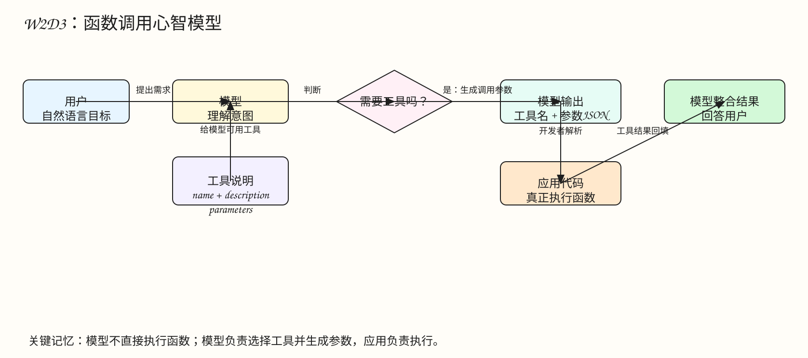
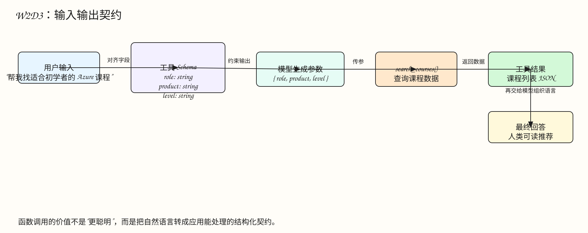
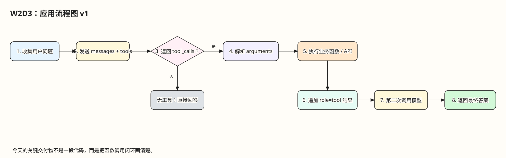
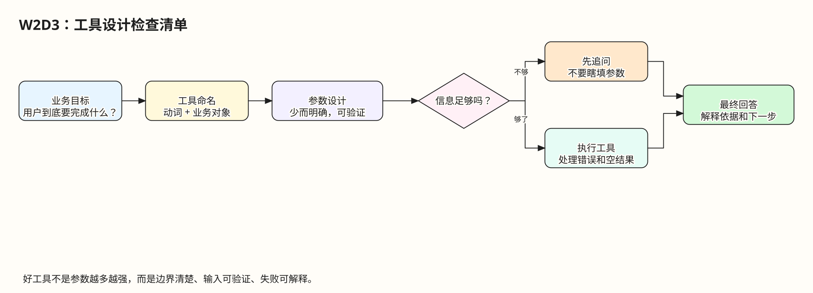

# W2D3 函数调用实战设计

AUTO_GUIDE_V2 | Notion: LLM-Checkin-Importer / W2D3 | Repo: openai/openai-cookbook | Local support: `11-integrating-with-function-calling`

## 今天在学什么

W2D3 的主题是“函数调用”，但不要把它理解成“让模型自己去运行代码”。更准确的说法是：

> 函数调用让模型把自然语言需求，转换成应用代码可以执行的结构化参数。

模型负责理解用户意图、选择合适工具、生成符合 schema 的参数；应用代码负责解析参数、真正执行函数/API/数据库查询，再把结果交回模型生成最终回答。

这一天的交付物是“应用流程图 v1”。也就是说，今天最重要的不是立刻写出复杂应用，而是把“用户输入如何进入模型、模型如何决定调用工具、工具结果如何回到模型、最终答案如何返回用户”这条链路画清楚。

## Excalidraw 图解速览



Excalidraw 源文件：[w2d3-tool-calling-mental-model.excalidraw](./diagrams/w2d3-tool-calling-mental-model.excalidraw)



Excalidraw 源文件：[w2d3-input-output-contract.excalidraw](./diagrams/w2d3-input-output-contract.excalidraw)



Excalidraw 源文件：[w2d3-app-flow-v1.excalidraw](./diagrams/w2d3-app-flow-v1.excalidraw)



Excalidraw 源文件：[w2d3-tool-design-checklist.excalidraw](./diagrams/w2d3-tool-design-checklist.excalidraw)

## 一句话理解函数调用

普通聊天像这样：

```text
用户：帮我找适合初学者的 Azure 课程。
模型：给出一段看起来合理的推荐。
```

函数调用像这样：

```text
用户：帮我找适合初学者的 Azure 课程。
模型：我应该调用 search_courses，参数是 role=developer, product=Azure, level=beginner。
应用：真正执行 search_courses(...)。
模型：根据工具返回的课程列表，组织成用户能读懂的推荐。
```

区别在于：普通聊天主要生成文本；函数调用把一部分回答过程变成“可执行流程”。

## 核心概念

### 1. Tool / Function 是给模型看的说明书

在 OpenAI Cookbook 的函数调用示例里，`tools` 是传给 Chat Completions API 的可选参数。它的作用不是直接执行函数，而是告诉模型：

- 有哪些工具可以用。
- 每个工具叫什么。
- 每个工具适合解决什么问题。
- 每个工具需要哪些参数。
- 每个参数的类型、含义、枚举值或必填规则是什么。

一个典型工具 schema 长这样：

```json
{
  "type": "function",
  "function": {
    "name": "search_courses",
    "description": "Find technical courses for a learner.",
    "parameters": {
      "type": "object",
      "properties": {
        "role": { "type": "string" },
        "product": { "type": "string" },
        "level": { "type": "string" }
      },
      "required": ["role"]
    }
  }
}
```

你可以把它理解成“模型和应用之间的接口契约”。

### 2. 模型不会替你执行函数

这是今天最容易误解的一点。

模型返回的通常是：

```json
{
  "tool_calls": [
    {
      "function": {
        "name": "search_courses",
        "arguments": "{\"role\":\"developer\",\"product\":\"Azure\",\"level\":\"beginner\"}"
      }
    }
  ]
}
```

这只是“我要调用哪个函数、参数是什么”。真正的 `search_courses(...)` 仍然要由你的 Python/JavaScript 应用执行。

### 3. 函数调用是一个闭环，不是一次请求

最小闭环通常有 4 步：

1. 第一次请求：发送 `messages + tools` 给模型。
2. 模型返回：如果需要工具，就返回 `tool_calls`。
3. 应用执行：解析参数，运行真实函数/API/数据库查询。
4. 第二次请求：把工具结果追加到对话，再让模型生成最终回答。

如果只做到第 2 步，那只是“模型生成了参数”；做到第 4 步，才是一个可用的工具调用应用。

## 对应源码与学习材料

### OpenAI Cookbook

重点阅读：

- `examples/How_to_call_functions_with_chat_models.ipynb`
- `examples/Function_calling_with_an_OpenAPI_spec.ipynb`
- `examples/How_to_call_functions_for_knowledge_retrieval.ipynb`

其中最适合 W2D3 的是第一个 notebook。它讲清楚两件事：

- 如何让模型根据 `tools` 生成函数参数。
- 如何由应用代码执行函数，再把结果交回模型。

### 本项目 Lesson 11

本地对应目录：

```text
11-integrating-with-function-calling/
```

重点文件：

- `README.md`：解释为什么需要函数调用，以及完整流程。
- `python/function_calling_demo.py`：课程推荐工具调用示例。
- `python/structured_output_demo.py`：对比普通 JSON 抽取和 tool schema 抽取。
- `typescript/function-app/src/main.ts`：TypeScript 版本函数调用应用雏形。

这几个文件可以这样读：

1. 先读 `README.md` 的 “Why Function Calling” 和 “Creating Your First Function Call”。
2. 再看 `function_calling_demo.py`，抓住 `tools`、`tool_calls`、`search_courses()`、`role=tool` 这几个点。
3. 最后看 `structured_output_demo.py`，理解 schema 如何让输出更稳定。

## 项目使用指南

### 如果你使用本项目的 Python 示例

进入目录：

```powershell
cd D:\Learning\generative-ai-for-beginners\11-integrating-with-function-calling\python
```

需要准备：

- Python 3.9+
- `openai`
- 一个可用的 OpenAI API Key

当前示例里 API Key 从这个文件读取：

```text
C:\OpenaiKey.txt
```

运行：

```powershell
python function_calling_demo.py
```

你应该重点观察输出里的三段：

- `First model response`：模型是否返回了工具调用。
- `Tool result`：本地函数实际返回了什么数据。
- `Final answer`：模型如何把工具结果转成人类可读回答。

### 如果你暂时不运行代码

也可以只完成纸上流程设计：

```text
用户输入：
“我是初学者，想学 Azure，有没有合适课程？”

工具：
search_courses(role, product, level)

模型应生成参数：
role = developer
product = Azure
level = beginner

应用执行：
search_courses("developer", "Azure", "beginner")

最终回答：
根据返回课程列表，推荐 1-3 个课程并说明理由。
```

这已经足够完成今天的“应用流程图 v1”。

## 最小练习

请设计一个自己的工具调用场景，建议从下面三个里选一个：

- `search_courses`：根据角色、技术、水平推荐课程。
- `search_notes`：根据关键词检索你的 Notion 学习笔记。
- `create_checkin`：把学习总结写入 Notion 打卡数据库。

然后写出 4 个部分：

```text
1. 用户会怎么问？
2. 工具 schema 需要哪些参数？
3. 应用代码执行什么真实动作？
4. 工具结果如何回到模型生成最终回答？
```

推荐你先选 `search_courses`，因为它最贴近 Lesson 11 和 Cookbook 示例。

## 今天的交付物：应用流程图 v1

你的流程图至少包含这些节点：

- 用户输入
- `messages + tools`
- 模型判断是否需要工具
- `tool_calls`
- 解析参数
- 执行业务函数/API
- 追加工具结果
- 第二次模型调用
- 最终回答

如果你能画出这条线，说明你已经掌握了函数调用最核心的工程结构。

## 常见误区

### 误区 1：以为模型真的调用了函数

不是。模型只是返回“建议调用哪个函数，以及参数是什么”。函数是你的代码执行的。

### 误区 2：工具参数越多越好

不是。参数越多，模型越容易填错，用户也越容易信息不足。先做少量、清晰、可验证的参数。

### 误区 3：工具描述随便写就行

不行。`description` 会影响模型什么时候选择这个工具、如何理解参数。描述越清楚，调用越稳定。

### 误区 4：拿到工具结果就结束

通常还要把工具结果作为 `role=tool` 的消息追加回对话，让模型把 JSON 或 API 数据转成自然语言答案。

## 自测问题与答案

### 1. 什么是函数调用？

函数调用是一种让模型根据工具 schema 生成结构化调用参数的机制。它把自然语言需求连接到应用里的真实函数、API 或数据库查询。

### 2. 模型会不会真的执行函数？

不会。模型只会输出工具名和参数。真正执行函数的是应用代码。

### 3. `tools` 里最重要的字段是什么？

最重要的是 `name`、`description`、`parameters`。`name` 决定工具身份，`description` 决定模型何时使用它，`parameters` 决定模型应该生成什么结构的参数。

### 4. 为什么函数调用通常需要第二次模型请求？

因为第一次请求通常只得到工具调用参数。应用执行工具后，还需要把工具结果追加回对话，让模型基于真实结果生成最终回答。

### 5. 什么时候应该让模型追问，而不是直接调用工具？

当必填参数缺失、用户目标含糊、工具执行会产生明显副作用，或错误参数会导致结果很差时，应该先追问。

## 学习总结

W2D3 要建立的是工程视角：LLM 不只是“会聊天的模型”，也可以成为应用流程中的“意图解析器”和“参数生成器”。函数调用的本质，是给模型一组清晰的工具说明，让它把用户的自然语言变成应用能执行的结构化请求。

今天你不需要把所有 API 细节都背下来，只要记住这条主线：

```text
用户目标 -> 模型理解 -> 工具 schema 约束 -> 生成参数 -> 应用执行 -> 工具结果 -> 模型总结 -> 用户答案
```

把这条链路画出来，你就真正进入了“从 Prompt 到 AI 应用设计”的阶段。

## Related Pages

- W2D2 上下文与模板
- W2D1 结构化输出
- Lesson 11: `11-integrating-with-function-calling`
- OpenAI Cookbook: `How_to_call_functions_with_chat_models.ipynb`
