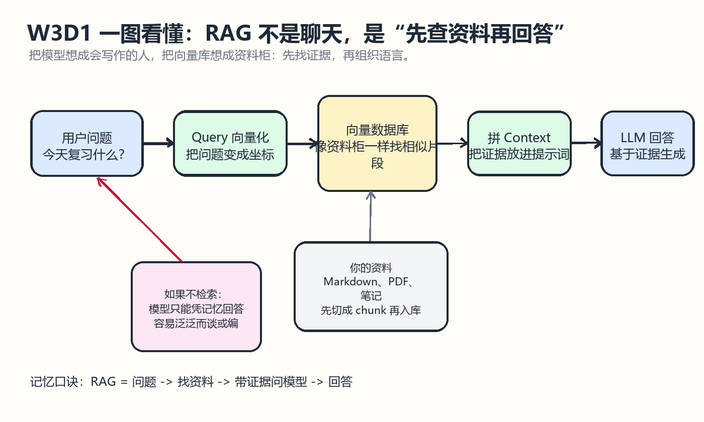
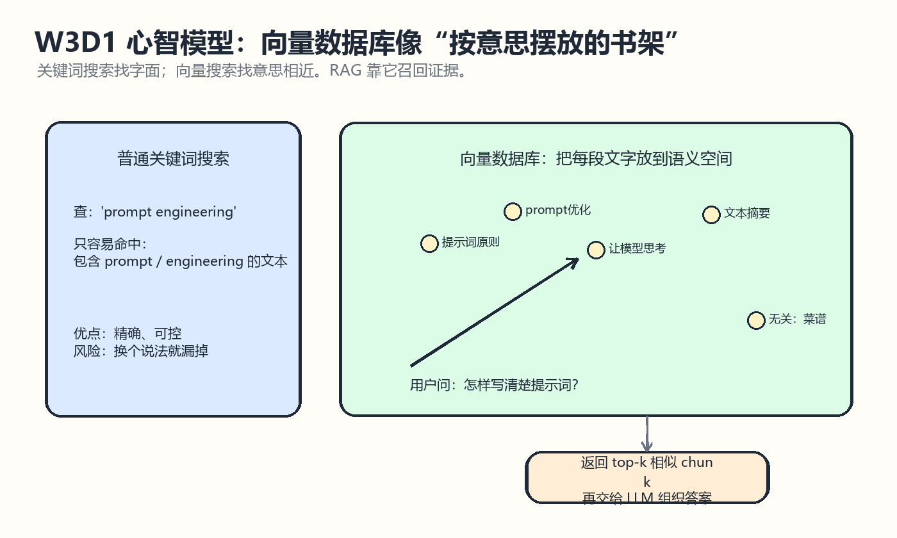

# W3D1 RAG 与向量数据库入门

## 一图看懂

先看这两张图，再读概念会顺很多：

一句话记忆：RAG 不是让模型硬背，而是“先去资料柜找证据，再让模型基于证据回答”。

## 学习目标
- 从 datawhalechina/llm-universe 的项目结构理解 RAG 主线。
- 解释 RAG、Embedding、向量数据库、Retriever、知识库之间的关系。
- 理解为什么 Week 3 要先学向量知识库，再学文档切分和向量检索。
- 为 W3D2 的 chunk 实验和 W3D3 的向量入库检索建立概念底座。

## 来源仓库
- 推荐仓库：datawhalechina/llm-universe
- GitHub：https://github.com/datawhalechina/llm-universe
- 本地路径：E:/Learning/llm-universe
- 重点材料：README.md、docs/C3/C3.md、docs/C4/C4.md、notebook/C3 搭建知识库/C3.ipynb。

## 仓库内容分析
llm-universe 的 README 把课程主线拆成“知识库搭建”和“构建 RAG 应用”两段。知识库搭建部分覆盖词向量、Embedding API、数据处理、向量数据库；RAG 应用部分进一步把向量库召回结果和 query 组合成 prompt，再输入 LLM 生成答案。

C3 的重点是搭建向量知识库。它先说明通用文本 embedding 会把文本映射成向量，在 RAG 中向量比原始文字更适合语义检索，因为可以通过点积、余弦距离、欧几里得距离等指标计算问题和资料片段的相似度。随后 C3 介绍 Chroma、Weaviate、Qdrant 等向量数据库，并使用 Chroma 完成知识库构建与相似度搜索。

C4 的重点是构建 RAG 应用。它在 C3 已经构建好的向量数据库基础上，通过 as_retriever 把向量库包装成检索器，再把检索到的文档片段和用户问题合并成 prompt，交给 LLM 输出回答。

## 核心概念
- RAG：Retrieval Augmented Generation，先检索资料，再增强 prompt，最后生成答案。
- Embedding：把文本转换成向量，让“语义相近”的文本在向量空间中距离更近。
- 向量数据库：存储 embedding 和文本 metadata，并按相似度返回相关 chunk。
- 知识库：不是单个文件夹，而是“原始文档 + 清洗切分 + embedding + 向量索引 + metadata”的整体。
- Retriever：把向量库封装成可调用的检索组件，负责根据 query 返回 top-k 文档片段。
- Grounded Answer：回答要基于检索上下文，而不是只依赖模型记忆。

## 最小流程
1. 收集知识文档，例如 Markdown、PDF、CSV、网页资料。
2. 清洗与切分文档，把长文档拆成可检索的 chunk。
3. 使用 embedding 模型把每个 chunk 转成向量。
4. 将 chunk、向量和 metadata 写入向量数据库。
5. 用户提问时，把 query 也转成向量。
6. 在向量数据库中检索 top-k 相似 chunk。
7. 把检索结果作为 context 拼进 prompt。
8. LLM 根据 context 和问题生成回答。

## llm-universe 对应代码线索
- C3 使用 RecursiveCharacterTextSplitter 进行文档切分。
- C3 使用 Chroma.from_documents 写入向量库。
- C3 使用 similarity_search(question, k=3) 做相似度检索。
- C4 使用 vectordb.as_retriever(search_kwargs={"k": 3}) 构造检索器。
- C4 使用 retriever、PromptTemplate、RunnableParallel、LLM 和 StrOutputParser 串起检索问答链。

## 注意点
- RAG 不等于“把文档塞进 prompt”，核心是先检索最相关片段。
- 向量检索依赖切分质量；chunk 切不好，embedding 再好也容易召回错误上下文。
- 向量数据库里必须保留 metadata，例如 source、chunk_index、页码、标题，方便追踪答案来源。
- 检索到相关文本不代表答案一定正确，仍要限制模型“只根据上下文回答”。
- 如果是多轮对话，要考虑把历史问题压缩或改写成完整 query，否则“它”“这个”等指代会导致检索失败。

## 今日产出
- 明确 Week 3 的学习主线：RAG 概念 -> 文档切分 -> 向量入库检索 -> 检索问答链。
- 确定 W3D2 继续做 chunk 策略实验。
- 确定 W3D3 继续做 embedding 与向量库检索闭环。
