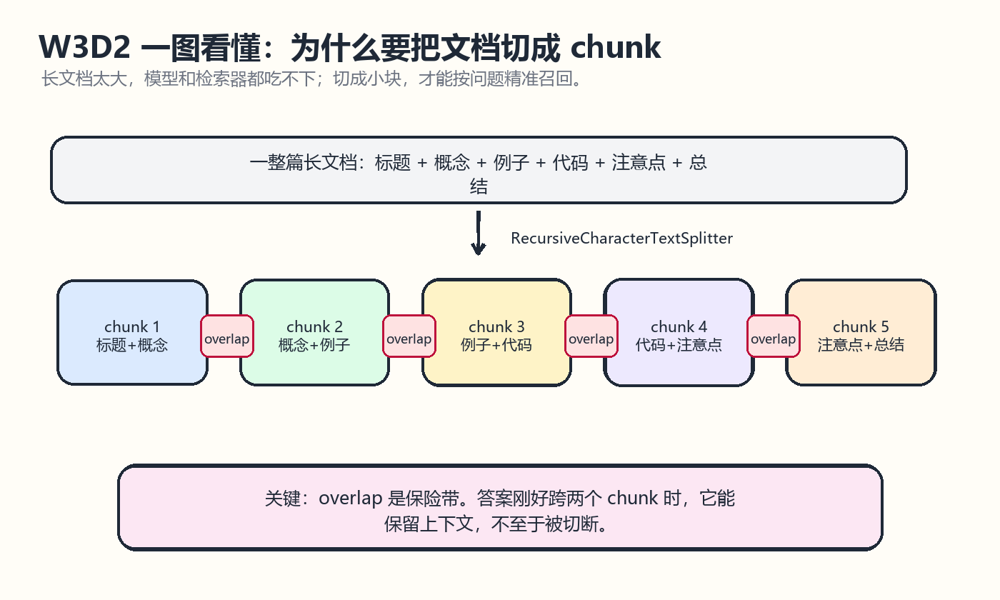
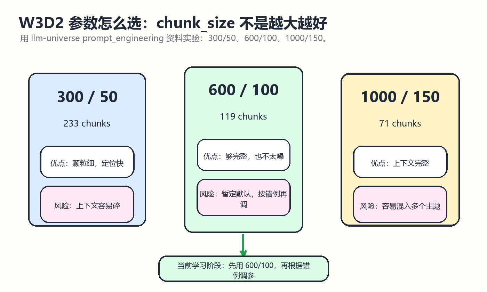

# W3D2 文档切分实验

## 一图看懂

先看这两张图：第一张讲 chunk 到底怎么切，第二张讲为什么本阶段先选 600/100。

一句话记忆：chunk_size 决定“每块多大”，chunk_overlap 决定“切口处保留多少上下文”。

## 学习目标
- 理解 RAG 中为什么要把长文档切成 chunk。
- 掌握 chunk_size、chunk_overlap、分隔符优先级三件事的作用。
- 用目标仓库 datawhalechina/llm-universe 的知识库资料做一次切分对比。
- 形成自己的默认切分策略，而不是盲目套参数。

## 来源仓库
- 推荐仓库：datawhalechina/llm-universe
- 本地路径：E:/Learning/llm-universe
- 重点材料：docs/C3/C3.md 的 3.3 数据处理、3.3.4 文档分割；notebook/C7 高级 RAG 技巧/2. 数据处理；data_base/knowledge_db/prompt_engineering。

## 仓库内容分析
llm-universe 把 RAG 的数据处理拆成几个清晰环节：读取文档、清洗内容、文档分割、向量化、入库与检索。C3 中明确说明，单个文档通常会超过模型上下文窗口，所以需要把文档分成多个 chunk；检索时也不是直接返回整篇文档，而是返回最相关的若干个 chunk。

C3 对 chunk_size 与 chunk_overlap 的解释很关键：chunk_size 控制每块的长度，chunk_overlap 让相邻块保留一段共享上下文，避免答案刚好被切断。C7 的高级 RAG 材料进一步提示：分块方式会影响召回质量，不同业务和不同文档结构需要单独评估。

## 本次实验数据
使用 llm-universe 自带的 prompt_engineering 知识库作为实验语料：

- 1. 简介 Introduction.md: 1811 字符
- 2. 提示原则 Guidelines.md: 11674 字符
- 3. 迭代优化 Iterative.md: 11995 字符
- 4. 文本概括 Summarizing.md: 2888 字符
- 5. 推断 Inferring.md: 3799 字符
- 6. 文本转换 Transforming.md: 14629 字符
- 7. 文本扩展 Expanding.md: 6645 字符
- 8. 聊天机器人 Chatbot.md: 3631 字符
- 9. 总结 Summary.md: 441 字符

## 切分策略对比
本次用轻量字符 n-gram 检索模拟向量召回，目的是观察不同 chunk 策略对检索颗粒度和上下文长度的影响：

- chunk_size=300, chunk_overlap=50: 233 个 chunk, 平均 294.7 字符
- chunk_size=600, chunk_overlap=100: 119 个 chunk, 平均 575.5 字符
- chunk_size=1000, chunk_overlap=150: 71 个 chunk, 平均 940.8 字符

## 实验观察
- 300/50：chunk 数量最多，检索颗粒更细，适合定位短答案，但上下文容易不完整，后续给 LLM 的信息可能碎片化。
- 600/100：chunk 数量适中，能保留较完整段落，又不会让单个 chunk 过长，本次作为默认推荐策略。
- 1000/150：chunk 数量少，上下文更完整，但一个 chunk 中可能混入多个主题，检索命中后噪声更大。

## 推荐策略
当前阶段建议先用 chunk_size=600、chunk_overlap=100。理由是它比 300 更能保留语义连续性，又比 1000 更容易精确命中主题。后续如果文档是 FAQ 或短条目，可以减小 chunk_size；如果文档是教程、论文或法律条款，可以适当增大 overlap。

## 核心概念
- chunk 是 RAG 检索的基本单位，不是越小越好，也不是越大越好。
- overlap 是为了保护跨边界语义，比如标题、定义、例子和结论之间的关系。
- RecursiveCharacterTextSplitter 的常见分隔符优先级是段落、换行、空格、字符，适合从自然文本开始试验。
- 切分策略决定检索系统的下限，embedding 和 rerank 往往是在此基础上继续优化。

## 注意点
- 不要只看 chunk 数量，要看检索结果是否能回答问题。
- 中文文档按字符切分可行，但最好尽量保留标题层级和段落边界。
- chunk_overlap 过大时会增加重复内容，浪费 token，也可能让相似结果过于集中。
- 对代码、表格、Markdown、PDF 应采用不同清洗方式，不要把所有源数据当纯文本处理。

## 今日产出
- 生成实验文件：学习笔记/w3d2_w3d3_llm_universe_experiment.json
- 生成可读报告：学习笔记/w3d2_w3d3_llm_universe_experiment.txt
- 确定 W3D3 入库检索默认切分策略：chunk_size=600、chunk_overlap=100。
