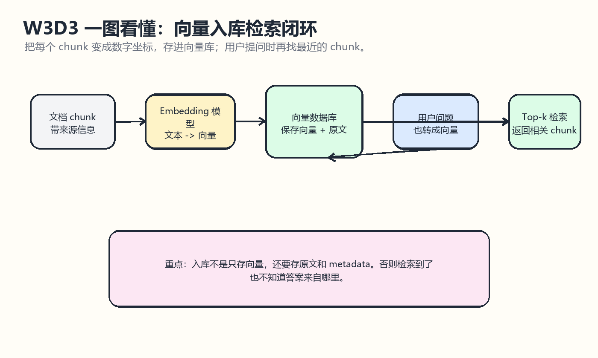
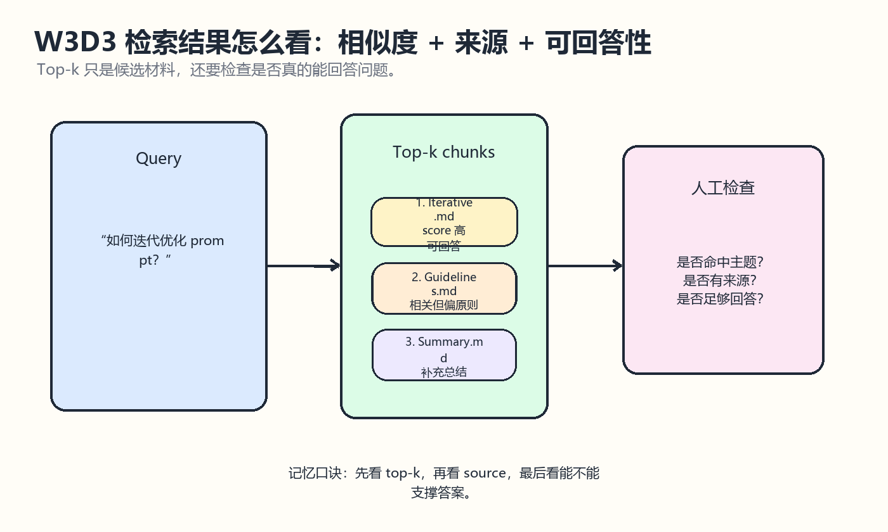

# W3D3 向量入库检索

## 一图看懂

先看这两张图：第一张讲“入库和检索”闭环，第二张讲检索结果不能只看 top-k，还要看来源和可回答性。

一句话记忆：入库要存向量、原文和来源；检索要看相似度、来源和是否真的能回答。

## 学习目标
- 理解 embedding、向量数据库、相似度检索之间的关系。
- 根据 llm-universe 的 C3/C4 示例，整理从文档到检索结果的最小闭环。
- 能解释 Chroma.from_documents、similarity_search、as_retriever 分别负责什么。
- 为后续 RAG 问答链打基础。

## 来源仓库
- 推荐仓库：datawhalechina/llm-universe
- 本地路径：E:/Learning/llm-universe
- 重点材料：docs/C3/C3.md 的 3.4 搭建并使用向量数据库、3.4.3 向量检索；docs/C4/C4.md 的 4.2 构建检索问答链；notebook/C3 搭建知识库/C3.ipynb。

## 仓库内容分析
llm-universe 的 C3 先解释 embedding 模型把文本变成向量，向量数据库负责存储和检索这些向量。它强调向量比关键词更适合语义检索，因为向量能表达文本的语义相似度。C3 的代码路径是：加载文档，切分文档，调用 embedding，把分块后的 documents 写入 Chroma，再用 similarity_search 返回最相似的文档片段。

C4 在此基础上把向量库包装为 retriever，并接入检索问答链。也就是说，W3D3 的重点不是“会调用一个数据库”，而是理解 RAG 最小闭环：query 向量化，向量库召回 chunk，LLM 基于 context 回答。

## 本次检索实验
使用 W3D2 推荐的 chunk_size=600、chunk_overlap=100，对 prompt_engineering 知识库做轻量检索验证。实验不是正式 embedding 模型，而是本地字符 n-gram 余弦相似度模拟，用来验证入库与召回流程是否跑通。

- 查询：提示词的两个核心原则是什么
  1. 1. 简介 Introduction.md / chunk 3 / score 0.0766: 任务的具体细节）。因此，当 LLM 无法正常工作时，有时是因为指令不够清晰。例如，如果您想问“请为我写一些关于阿兰·图灵( Alan Turing )的东西”，在此基础上清楚表明您希望文本专注于他的科学工作、个人生活、历史角色或其他方面可能
  2. 9. 总结 Summary.md / chunk 0 / score 0.0662: 第九章 总结 恭喜您完成了本书第一单元内容的学习！ 总的来说，在第一部分中，我们学习并掌握了关于 Prompt 的两个核心原则： 编写清晰具体的指令； 如果适当的话，给模型一些思考时间。 您还学习了迭代式 Prompt 开发的方法，并了解了
  3. 2. 提示原则 Guidelines.md / chunk 0 / score 0.0599: 第二章 提示原则 如何去使用 Prompt，以充分发挥 LLM 的性能？首先我们需要知道设计 Prompt 的原则，它们是每一个开发者设计 Prompt 所必须知道的基础概念。本章讨论了设计高效 Prompt 的两个关键原则： 编写清晰、具
- 查询：如何迭代优化 prompt
  1. 3. 迭代优化 Iterative.md / chunk 0 / score 0.6324: 第三章 迭代优化 在开发大语言模型应用时，很难通过第一次尝试就得到完美适用的 Prompt。但关键是要有一个 良好的迭代优化过程 ，以不断改进 Prompt。相比训练机器学习模型，Prompt 的一次成功率可能更高，但仍需要通过多次迭代找到
  2. 2. 提示原则 Guidelines.md / chunk 1 / score 0.4885: 前坐着一位来自外星球的新朋友，其对人类语言和常识都一无所知。在这种情况下，您需要把想表达的意图讲得非常明确，不要有任何歧义。同样的，在提供 Prompt 的时候，也要以足够详细和容易理解的方式，把您的需求与上下文说清楚。 并不是说 Prom
  3. 2. 提示原则 Guidelines.md / chunk 0 / score 0.4646: 第二章 提示原则 如何去使用 Prompt，以充分发挥 LLM 的性能？首先我们需要知道设计 Prompt 的原则，它们是每一个开发者设计 Prompt 所必须知道的基础概念。本章讨论了设计高效 Prompt 的两个关键原则： 编写清晰、具
- 查询：文本概括任务应该如何设计 prompt
  1. 2. 提示原则 Guidelines.md / chunk 0 / score 0.4222: 第二章 提示原则 如何去使用 Prompt，以充分发挥 LLM 的性能？首先我们需要知道设计 Prompt 的原则，它们是每一个开发者设计 Prompt 所必须知道的基础概念。本章讨论了设计高效 Prompt 的两个关键原则： 编写清晰、具
  2. 3. 迭代优化 Iterative.md / chunk 0 / score 0.4188: 第三章 迭代优化 在开发大语言模型应用时，很难通过第一次尝试就得到完美适用的 Prompt。但关键是要有一个 良好的迭代优化过程 ，以不断改进 Prompt。相比训练机器学习模型，Prompt 的一次成功率可能更高，但仍需要通过多次迭代找到
  3. 2. 提示原则 Guidelines.md / chunk 1 / score 0.4179: 前坐着一位来自外星球的新朋友，其对人类语言和常识都一无所知。在这种情况下，您需要把想表达的意图讲得非常明确，不要有任何歧义。同样的，在提供 Prompt 的时候，也要以足够详细和容易理解的方式，把您的需求与上下文说清楚。 并不是说 Prom

## 最小闭环
1. 准备文档：读取 Markdown、PDF、CSV、网页等资料。
2. 清洗文档：去掉无效格式、导航、重复文本和乱码。
3. 文档切分：用 chunk_size 与 overlap 控制检索颗粒度。
4. 生成 embedding：把每个 chunk 转成向量。
5. 写入向量库：保存文本、向量和 metadata。
6. 查询检索：把用户问题转成向量，找 top-k 相似 chunk。
7. 接入 LLM：把检索到的 chunk 作为 context，再让模型回答。

## llm-universe 对应代码概念
- Chroma.from_documents：把切好的 documents 加 embedding 写进 Chroma。
- similarity_search(question, k=3)：按相似度返回最相关的 k 个 chunk。
- as_retriever(search_kwargs={"k": 3})：把向量库包装成 LangChain 检索器，方便接入链式调用。
- retriever | combiner：C4 中把检索器和文档组合器串起来，形成检索链。
- 带聊天记录的检索：C4 通过历史信息压缩或改写问题，让多轮对话中的“它”“这个”等指代更容易被正确检索。

## 注意点
- 向量库里必须保存 metadata，例如来源文件、chunk_index、页码或标题，否则检索结果很难解释和排错。
- top-k 不是越大越好；k 太小可能漏召回，k 太大可能把噪声塞进上下文。
- 相似度检索只能解决“找相关材料”，不能保证材料一定正确、完整或可直接回答。
- 真实项目中要记录 query、召回 chunk、最终答案，方便做 RAG 评估。
- 如果用户问题依赖上下文，需要先改写 query，再检索，否则会出现“它是谁”这类问题检索失败。

## 今日产出
- 跑通本地轻量版入库检索实验。
- 明确正式版本应替换为真实 embedding 模型和 Chroma/Faiss/Qdrant 等向量库。
- 为下一步 RAG 问答链准备默认参数：chunk_size=600、chunk_overlap=100、top_k=3。
