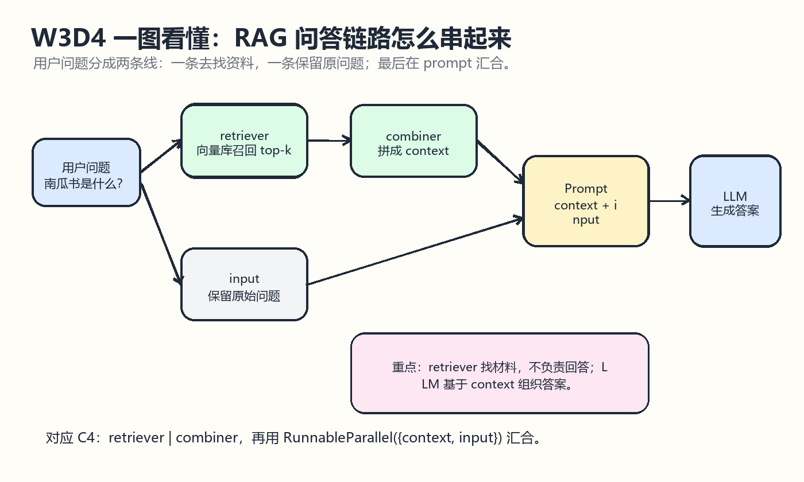
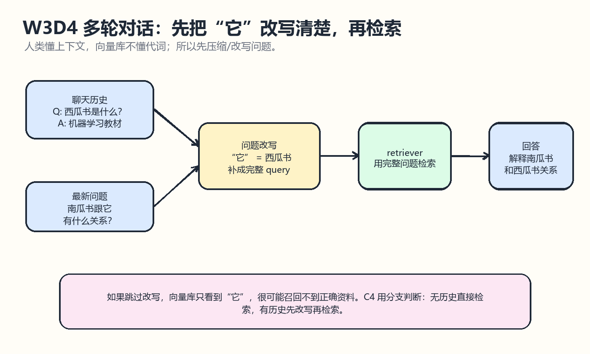

# W3D4 问答链路串联

## 一图看懂

先看这两张图：第一张讲单轮 RAG 问答链如何串起来，第二张讲多轮对话中为什么要先改写问题再检索。

一句话记忆：W3D4 的核心不是“检索到了文档”就结束，而是把 retriever、context、prompt、LLM、parser 串成稳定的回答流水线。

## 学习目标
- 理解 W3D3 的向量检索结果如何进入 LLM。
- 能解释 retriever、combiner、PromptTemplate、RunnableParallel、StrOutputParser 的分工。
- 看懂 llm-universe C4 中从检索器到 qa_chain 的链路写法。
- 理解多轮对话中“它”“这个”等指代为什么会影响检索。
- 能画出单轮 RAG 链路和带历史记录的 RAG 链路。

## 来源仓库
- 推荐仓库：datawhalechina/llm-universe
- GitHub：https://github.com/datawhalechina/llm-universe
- 本地路径：E:/Learning/llm-universe
- 重点材料：docs/C4/C4.md 的 4.2 构建检索问答链；notebook/C4 构建 RAG 应用/C4.ipynb；notebook/C4 构建 RAG 应用/streamlit_app.py。

## 仓库内容分析
llm-universe 的 C4 章节承接 C3 已经构建好的向量数据库。C4 不是重新讲 embedding 或入库，而是把向量数据库包装成 retriever，然后把 query 检索出来的文档片段和用户问题一起组合进 prompt，交给 LLM 生成答案。

C4 的关键步骤很清晰：先用 vectordb.as_retriever(search_kwargs={"k": 3}) 把向量库变成检索器；再定义 combine_docs，把多个 Document 的 page_content 拼成上下文；然后用 retriever | combiner 得到 retrieval_chain；最后用 RunnableParallel 同时准备 context 和 input，把它们送进 PromptTemplate、LLM 和 StrOutputParser。

C4 后半部分进一步指出，多轮对话里用户问题可能语义不完整。例如用户先问“西瓜书是什么？”，下一句问“南瓜书跟它有什么关系？”，如果直接拿“它”去检索，向量库未必知道“它”指西瓜书。所以 C4 使用 RunnableBranch：没有 chat_history 时直接检索，有 chat_history 时先让 LLM 根据历史完善问题，再检索。

## 核心概念
- retriever：检索器，负责把用户问题变成向量检索请求，并返回 top-k 文档片段。
- combiner：文档组合器，把多个检索结果拼成一个 context 字符串。
- retrieval_chain：检索链，通常是 retriever | combiner，输入问题，输出上下文。
- PromptTemplate：把 context 和 input 填进提示词模板。
- RunnableParallel：并行准备 context 和 input，一个来自检索链，一个保留原始问题。
- qa_chain：完整问答链，通常是 context/input -> prompt -> llm -> parser。
- history-aware retrieval：带历史感知的检索，先把不完整问题改写完整，再去检索。

## 最小流程
1. 加载 W3D3 已经构建好的向量数据库。
2. 使用 as_retriever(search_kwargs={"k": 3}) 得到检索器。
3. 用户输入问题。
4. retriever 返回最相关的 k 个 Document。
5. combine_docs 把 Document.page_content 拼成 context。
6. PromptTemplate 把 context 和 input 填入问答模板。
7. LLM 基于 context 回答。
8. StrOutputParser 把模型输出转成字符串。

## 关键代码心智模型

~~~python
retriever = vectordb.as_retriever(search_kwargs={"k": 3})

def combine_docs(docs):
    return "\n\n".join(doc.page_content for doc in docs)

retrieval_chain = retriever | combine_docs

qa_chain = (
    RunnableParallel({"context": retrieval_chain, "input": RunnablePassthrough()})
    | prompt
    | llm
    | StrOutputParser()
)
~~~

这段代码可以理解为：用户问题一路分成两条线，一条去检索资料并生成 context，另一条保留原始 input；两条线在 PromptTemplate 汇合，再交给 LLM 回答。

## 多轮对话注意点
- 没有历史记录时，可以直接用用户问题检索。
- 有历史记录时，最好先把用户最新问题改写成完整问题。
- “它”“这个”“刚才那个”这类词对人类清楚，对向量数据库不清楚。
- 历史记录不要无限塞入 prompt，要考虑压缩、截断和保留关键信息。
- 多轮 RAG 的质量取决于两个步骤：问题改写是否准确，检索召回是否命中。

## 注意点
- 不要把 retriever 的输出直接当答案；它只是材料，还需要 LLM 组织语言。
- prompt 中必须要求“如果不知道就说不知道”，降低幻觉风险。
- top_k 需要调参：太小可能漏掉答案，太大可能带入噪声。
- combine_docs 最好保留来源 metadata，后续便于做引用和排错。
- 单轮链路跑通后，再做带 chat_history 的链路，否则排查会很乱。

## 今日产出
- 完成 W3D4 RAG 问答链路学习笔记。
- 生成单轮 RAG 问答链路草图。
- 生成历史感知检索草图。
- 在 Notion LLM-Checkin-Importer 对应行写入课程内容。