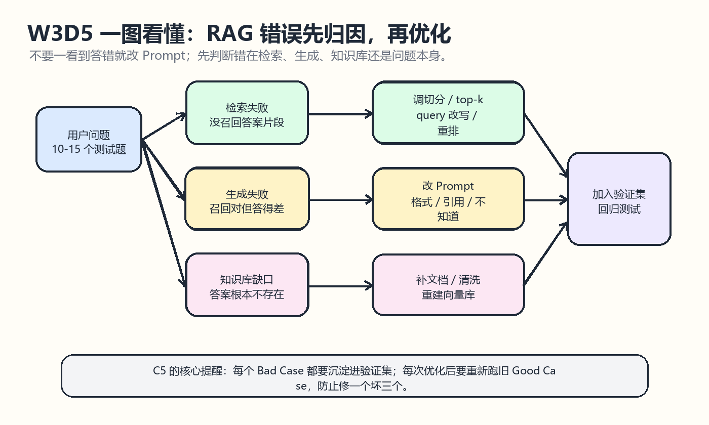
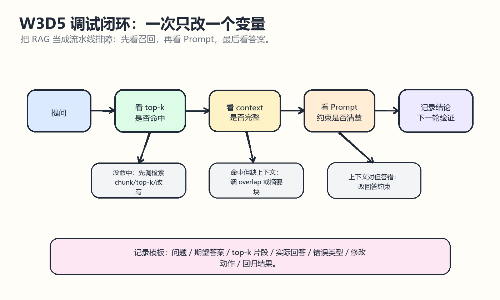

# W3D5 错误分析

## 一图看懂
今天先用两张图建立排障脑图：第一张把 RAG 错误拆成检索、生成、知识库缺口；第二张把一次错误分析变成可重复的调试闭环。

一句话记忆：RAG 答错时，不要急着改 Prompt；先看 top-k 召回是否命中，再看 context 是否完整，最后才看模型回答格式和约束。

## 学习目标
- 能从 llm-universe C5 理解“验证迭代”为什么是 LLM 应用开发的核心。
- 能把 10 到 15 个测试问题整理成 Bad Case 清单。
- 能区分生成失败、检索失败、知识库缺口和用户问题不清。
- 能把每个 Bad Case 加入验证集，避免只修复当前问题却破坏旧 Good Case。
- 能给每类错误匹配一个下一步优化动作。

## 来源仓库
- 推荐仓库：datawhalechina/llm-universe
- GitHub：https://github.com/datawhalechina/llm-universe
- 本地路径：E:/Learning/llm-universe
- 重点材料：docs/C5/C5.md 的 5.1 评估思路、5.2 生成部分优化、5.3 检索部分评估与优化；docs/C1/C1.md 的 Bad Case 迭代流程。

## 仓库内容分析
llm-universe 的 C5 明确指出，LLM 应用不是先准备一千条样本再训练，而是先用少量样本快速跑通，再在真实测试中不断收集 Bad Case。随着 Bad Case 变多，验证集会逐步扩大，后续每次优化都要重新验证旧样例，确保系统没有退化。

C5 还把 RAG 的错误拆成两个核心环节：检索部分负责找到能回答问题的文本片段，生成部分负责在拿到正确片段后组织出满足用户要求的回答。因此错误分析时要先判断“正确答案是否在召回片段里”。如果不在，优先优化检索和知识库；如果在，优先优化 Prompt、回答格式和引用约束。

## 核心概念
- Bad Case：系统没有达到预期的测试样例，不只是“答错”，也包括太啰嗦、没重点、没引用、格式不符合要求。
- 验证集：由 Good Case 和 Bad Case 共同组成，用来检查每次优化是否真的提升系统，而不是局部修补。
- 检索失败：top-k 文档没有包含正确答案，需要看切分、embedding、top-k、query 改写、重排。
- 生成失败：召回片段正确，但模型回答不清楚、不完整、乱编或格式不符合要求。
- 知识库缺口：正确答案本来就不在知识库，应该补文档、清洗文本或重建向量库。

## 10 到 15 个问题测试法
1. 准备 10 到 15 个覆盖不同难度的问题。
2. 对每个问题保存期望答案或答案来源。
3. 记录系统实际回答。
4. 打印或保存 top-k 检索片段。
5. 判断答案是否在 top-k 中。
6. 标注错误类型：检索失败、生成失败、知识库缺口、问题不清。
7. 为每个错误写一个最小修改动作。
8. 修改后重新跑全部样例，而不是只跑出错样例。

## Bad Case 记录模板
| 字段 | 写法 |
|---|---|
| 问题 | 用户原始问题 |
| 期望答案 | 正确答案或应命中的资料 |
| top-k 片段 | 检索返回的前几个 chunk |
| 实际回答 | LLM 输出 |
| 错误类型 | 检索失败 / 生成失败 / 知识库缺口 / 问题不清 |
| 优化动作 | 调 chunk、调 top-k、改 Prompt、补文档等 |
| 回归结果 | 修改后是否通过，旧 Good Case 是否仍通过 |

## 注意点
- 不要把所有错误都归因成“模型不够聪明”；RAG 的多数问题发生在数据、切分和检索。
- 评估检索时要确认正确答案确实存在于知识库，否则不能算检索失败。
- top-k 太小容易漏召回，top-k 太大可能引入噪声。
- 修改 Prompt 前先看 context，如果 context 本身不含答案，Prompt 再漂亮也会逼模型编。
- 每次只改一个变量，否则很难知道到底是哪一步起作用。

## 今日产出
- 一份 W3D5 错误分析学习笔记。
- 两张 Excalidraw 风格草图：Bad Case 分类图、RAG 调试闭环图。
- 一套可复用的 Bad Case 清单模板。
