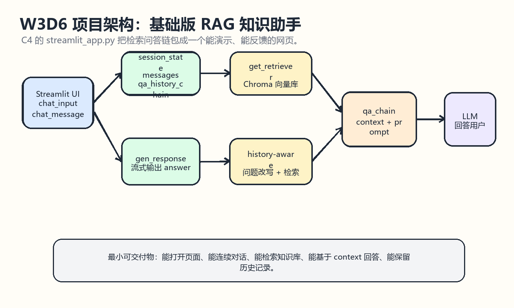
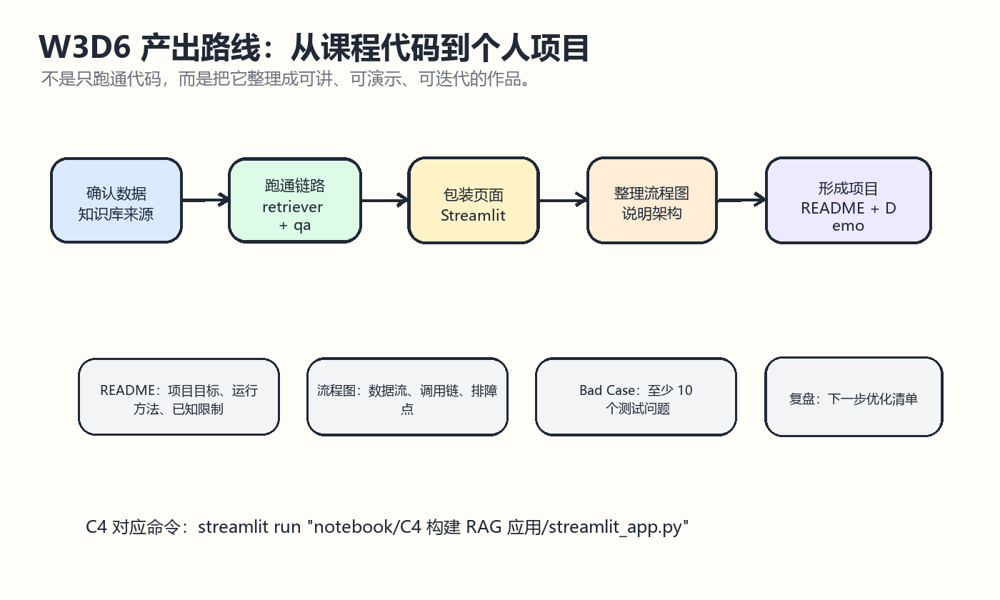

# W3D6 项目与流程图产出

## 一图看懂
今天把 W3 前几天学到的 RAG 链路打包成一个“能展示、能解释、能继续迭代”的基础项目。





一句话记忆：D6 的重点不是多写功能，而是把数据、检索、问答链、页面、流程图和 README 串成一个可交付 Demo。

## 学习目标
- 能看懂 llm-universe C4 的 Streamlit 知识库助手结构。
- 能解释 `get_retriever`、`combine_docs`、`get_qa_history_chain`、`gen_response` 和 `main` 的职责。
- 能把 RAG 项目画成数据流和调用链。
- 能整理 `rag-knowledge-assistant` 初版交付清单。
- 能说清楚当前 Demo 的能力边界和下一步优化方向。

## 来源仓库
- 推荐仓库：datawhalechina/llm-universe
- GitHub：https://github.com/datawhalechina/llm-universe
- 本地路径：E:/Learning/llm-universe
- 重点材料：docs/C4/C4.md 的 4.3 部署知识库助手；notebook/C4 构建 RAG 应用/streamlit_app.py。

## 仓库内容分析
C4 的 4.3 说明 Streamlit 可以用普通 Python 快速搭建交互式 Web Demo，不需要写 HTML、CSS 或 JavaScript。课程示例把前面完成的向量库、检索器和问答链包装到 `streamlit_app.py` 中，让用户可以在网页里连续提问。

`streamlit_app.py` 的主线很清楚：`get_retriever` 加载 Chroma 向量数据库并返回检索器；`combine_docs` 把检索到的文档片段拼成上下文；`get_qa_history_chain` 构建支持历史记录的问题改写和问答链；`gen_response` 负责流式输出；`main` 负责页面、聊天记录和状态管理。

## 核心结构
- UI 层：`st.chat_input` 接收问题，`st.chat_message` 展示人类和 AI 消息。
- 状态层：`st.session_state.messages` 保存聊天历史，`st.session_state.qa_history_chain` 保存问答链。
- 检索层：Chroma 向量库通过 `as_retriever` 返回相关文档片段。
- 改写层：有历史记录时，先把用户最新问题改写成完整 query。
- 生成层：把 context、chat_history 和 input 填入 Prompt，再让 LLM 生成答案。
- 输出层：`st.write_stream` 将答案流式展示到页面。

## 项目交付清单
| 交付物 | 最小要求 |
|---|---|
| README | 项目目标、运行命令、依赖、API Key 配置、已知限制 |
| 流程图 | 数据入库流程、问答链流程、错误分析流程 |
| Demo | 能打开 Streamlit 页面，能连续提问 |
| 测试问题 | 至少 10 个，覆盖简单事实、概括、多轮追问和边界问题 |
| Bad Case | 记录错误类型、top-k、实际回答和优化动作 |

## 本地运行参考
```powershell
cd E:\Learning\llm-universe
streamlit run "notebook/C4 构建 RAG 应用/streamlit_app.py"
```

如果运行失败，优先检查三件事：依赖是否安装、API Key 是否可读、`data_base/vector_db/chroma` 是否已经构建。

## 注意点
- Demo 能运行不等于项目可交付，还要能说明数据流、模块职责和限制。
- `session_state` 是 Streamlit 多轮对话的关键，否则每次刷新都会丢历史。
- 多轮 RAG 不是简单把历史全部塞进 Prompt，课程里使用了“先改写问题再检索”的思路。
- README 要写已知限制，例如知识库覆盖不足、检索可能漏召回、回答依赖模型质量。
- 流程图尽量一张图讲一个问题，不要把所有概念塞进同一个大盒子。

## 今日产出
- 一份 W3D6 项目整理学习笔记。
- 两张 Excalidraw 风格草图：项目架构图、交付物流图。
- `rag-knowledge-assistant` 初版交付清单。
