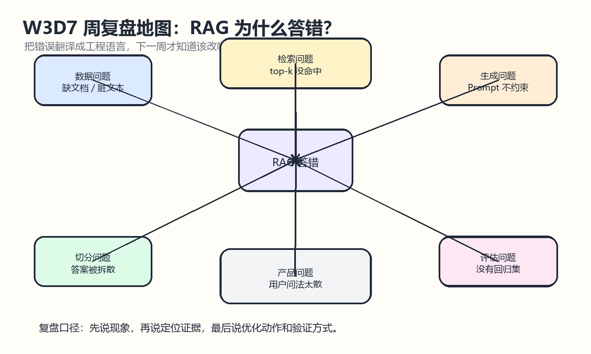
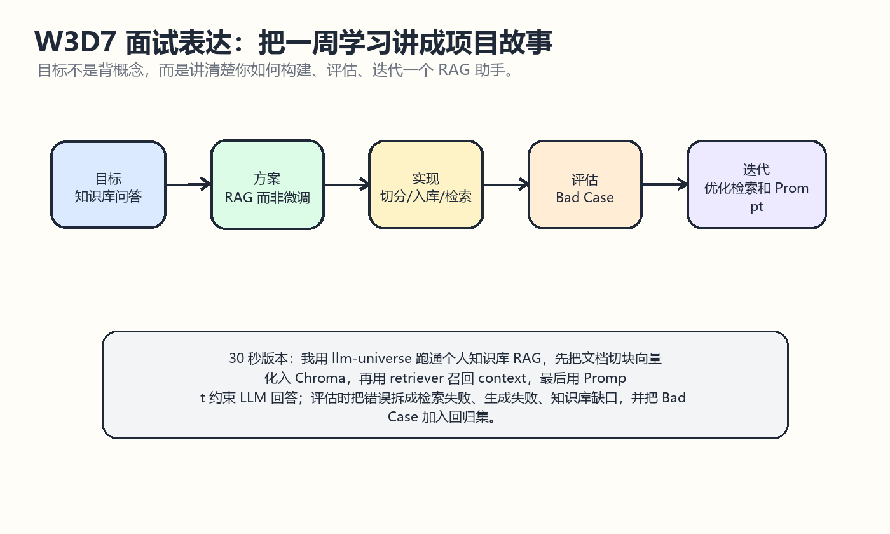

# W3D7 周复盘

## 一图看懂
今天把 W3 的 RAG 学习收束成两件事：第一，RAG 为什么答错；第二，如何把一周学习讲成一个项目故事。

一句话记忆：RAG 不是“接个向量库就会变准”，它是一条数据工程、检索工程、Prompt 工程和评估工程共同组成的流水线。

## 学习目标
- 能复盘 W3D1 到 W3D6 的主线：RAG、切分、入库、检索、问答链、评估、项目包装。
- 能用工程语言解释 RAG 为什么答错。
- 能把错误归因到数据、切分、检索、生成、评估或产品问题。
- 能准备一段 30 秒到 2 分钟的面试表达。
- 能列出下一周继续优化的方向。

## 来源仓库
- 推荐仓库：datawhalechina/llm-universe
- GitHub：https://github.com/datawhalechina/llm-universe
- 本地路径：E:/Learning/llm-universe
- 重点材料：docs/C1/C1.md 的 RAG 流程和 Bad Case 迭代；docs/C4/C4.md 的问答链和 Streamlit Demo；docs/C5/C5.md 的系统评估与优化。

## 仓库内容分析
llm-universe 的 W3 学习主线可以从 C1、C3、C4、C5 串起来：C1 建立 RAG 为什么存在，以及 LLM 应用要通过 Bad Case 验证迭代；C3 负责文档处理、切分、embedding 和向量数据库；C4 负责把检索器、Prompt、LLM 和 Streamlit 页面串成应用；C5 负责把系统输出拿来评估，并分别优化检索和生成。

这条主线非常适合整理成项目表达：先说为什么选择 RAG，再说如何构建知识库和检索链，然后说如何评估错误，最后说下一步如何优化。

## W3 核心概念对照
| 天数 | 核心问题 | 一句话 |
|---|---|---|
| W3D1 | RAG 是什么 | 先查资料，再让模型基于资料回答 |
| W3D2 | 文档怎么切 | chunk 决定答案是否能被完整召回 |
| W3D3 | 如何入库检索 | embedding 把文本放进语义空间，top-k 找近邻 |
| W3D4 | 如何串问答链 | context + input + prompt + LLM 组成回答流水线 |
| W3D5 | 怎么评估错误 | Bad Case 要归因并加入验证集 |
| W3D6 | 怎么做项目 | 用 Streamlit 包装成可演示 Demo |
| W3D7 | 怎么复盘表达 | 把学习讲成目标、方案、实现、评估、迭代 |

## RAG 为什么答错
- 数据问题：知识库没有覆盖答案，或原始文档脏、重复、格式混乱。
- 切分问题：答案被切到多个 chunk，中间缺少 overlap 或语义边界。
- 检索问题：top-k 没命中，关键词误导，embedding 模型不适合当前业务。
- 生成问题：context 对了，但 Prompt 没要求引用、格式、边界或“不知道就说不知道”。
- 评估问题：没有验证集，改完只看一个样例，导致旧问题退化。
- 产品问题：用户问题过于含糊，需要追问、改写或限定范围。

## 面试表达模板
30 秒版本：

我用 llm-universe 跑通了一个个人知识库 RAG 助手。流程是先把文档加载、清洗、切分，再用 embedding 入 Chroma 向量库；用户提问后通过 retriever 召回 top-k 片段，把 context 和问题一起交给 LLM 回答。评估时我不会只看答案对错，而是把 Bad Case 拆成检索失败、生成失败和知识库缺口，再分别优化 chunk、top-k、query 改写或 Prompt，并把错误样例加入回归集。

2 分钟版本可以补充：
- 为什么 RAG 比直接问模型更适合私有知识库。
- chunk_size 和 overlap 如何影响召回。
- 多轮问题里为什么要先改写 query 再检索。
- 为什么检索失败时改 Prompt 没用。
- 如何用 Bad Case 推动下一轮优化。

## 下一步优化方向
- 建立固定测试集：至少 30 个问题，覆盖事实、概括、多轮、边界和无答案问题。
- 保存检索日志：每次回答都记录 top-k 文档、score、metadata 和最终答案。
- 优化切分策略：针对 Markdown 标题、列表和段落做语义切分。
- 增加引用来源：回答中展示命中的文档名和片段位置。
- 引入重排或混合检索：减少关键词误导和语义近但无答案的问题。

## 今日产出
- 一份 W3D7 周复盘学习笔记。
- 两张 Excalidraw 风格草图：周复盘地图、面试表达故事线。
- 一段可用于面试或项目 README 的 RAG 学习表达。
